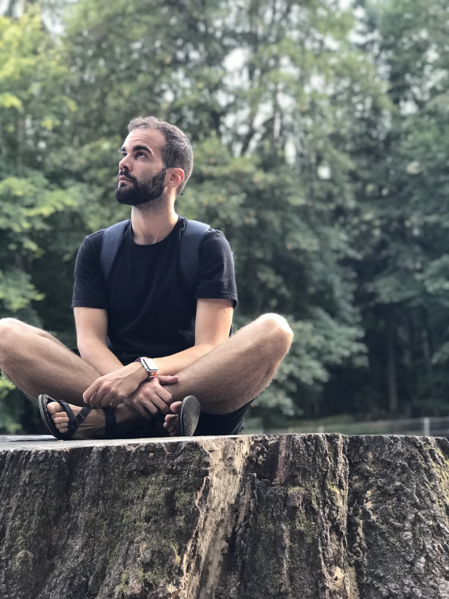

  

    

      Hey there, I'm Ruben! I'm a Biological Data Scientist, (or Bioinformatician) working in biomedical research in *University Pompeu Fabra*.
    

  

  
  

    
  

I started as a biochemist, but my love for programming and the huge interest I have in how the actual amount of data let us predict ordinary things made me shift to Data Science :)

During my path until I'm now I developed multiple abilities in the data science field, like ETL pipelines, Machine Learning Algorithms , Deep Learning Models and Statistical Analysis.

I'm extremely curious and I always want to learn new things, since I believe that learning let us improve every day.

## What is this blog?

This blog will be my collection of tips and recipes at disposal of anybody who needs them to learn new aspects of Data Science, since this field is constantly evolving at a quick pace.

I'm going to cover concepts of Machine Learning, Base Statistics and Data engineering.

I hope you find the things I am sharing useful to you, if yes, you can contact me on twitter [@RubenMolina03] (https://twitter.com/RubenMolina03) and I will be glad to answer!

